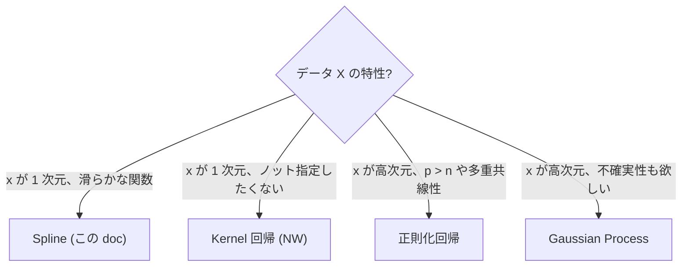

# Spline 回帰

> 🌐 [English](04-spline.md) | **日本語**

> 関数形を仮定せず滑らかな曲線を当てる **非パラメトリック** 回帰。
> `Model.Spline` モジュール。
>
> 関連: [04-kernel.ja.md](04-kernel.ja.md) (カーネル回帰) / [04-regularized.ja.md](04-regularized.ja.md) (正則化) /
> 理論: [theory-regression-extensions.ja.md](theory-regression-extensions.ja.md)

## 1. 用途
- 関数形を仮定せず滑らかな曲線を当てたい
- 外挿は控えめ (Natural は端で線形外挿、B-spline は端で 0)

## 2. API

```haskell
import Model.Spline

data SplineKind = BSpline Int | NaturalCubic
data SplineFit = SplineFit { sfKind :: SplineKind
                           , sfKnots :: [Double]
                           , sfBeta :: Vector Double
                           , sfResult :: FitResult }

fitSpline     :: SplineKind -> [Double] -> Vector Double -> Vector Double -> SplineFit
predictSpline :: SplineFit -> Vector Double -> Vector Double

equalSpacedKnots :: Int -> Double -> Double -> [Double]
quantileKnots    :: Int -> Vector Double -> [Double]
```

## 3. ミニマル例

```haskell
import qualified Data.Vector as V
import Model.Spline

let xs = V.fromList [0, 0.1, 0.2, ..., 1.0]
    ys = V.fromList [...]
    knots = equalSpacedKnots 8 0 1   -- 8 個の等間隔ノット

let fit = fitSpline (BSpline 3) knots xs ys   -- cubic B-spline
let xNew = V.fromList [0, 0.05, 0.10, ..., 1.0]
    yNew = predictSpline fit xNew
```

## 4. ノットの選び方

| 状況 | 推奨 |
|---|---|
| データが均等に分布 | `equalSpacedKnots` |
| データに偏りあり | `quantileKnots` (各ビンに同程度のサンプル) |
| ノット数 | n/4 〜 n/8 程度から始める。多すぎると過学習 |

## 5. BSpline vs NaturalCubic

| | BSpline | NaturalCubic |
|---|---|---|
| 端の挙動 | 抑え込まれる (0 に近づく) | 線形外挿 |
| 係数次元 | knots + k - 1 | knots 数 |
| 滑らかさ | k 次微分まで連続 | 2 次微分まで連続 |
| 境界での過剰振動 | 少ない | やや出る |

## 6. demo

```bash
cabal run spline-demo
# → spline.html (真値=灰破線、B-spline=青、Natural=オレンジ、観測=黒)
```

## 7. 他手法との比較



## 関連リンク

- カーネル回帰: [04-kernel.ja.md](04-kernel.ja.md)
- 正則化回帰: [04-regularized.ja.md](04-regularized.ja.md)
- 多次元入力 GP: [04-gp.ja.md](04-gp.ja.md)
- 理論背景: [theory-regression-extensions.ja.md](theory-regression-extensions.ja.md)
