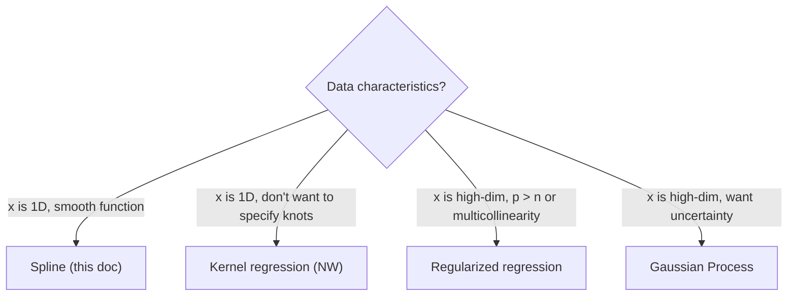

# Spline Regression

> 🌐 **English** | [日本語](04-spline.ja.md)

> **Nonparametric** regression that fits smooth curves without assuming functional form.
> `Hanalyze.Model.Spline` module.
>
> Related: [04-kernel.md](04-kernel.md) (Kernel regression) / [04-regularized.md](04-regularized.md) (Regularized) /
> Theory: [theory-regression-extensions.ja.md](theory-regression-extensions.ja.md)

## 1. Use Cases
- Fit smooth curves without assuming functional form
- Extrapolation should be conservative (Natural is linear at ends, B-spline is 0)

## 2. API

```haskell
import Hanalyze.Model.Spline

data SplineKind = BSpline Int | NaturalCubic
data SplineFit = SplineFit { sfKind :: SplineKind
                           , sfKnots :: [Double]
                           , sfBeta :: Vector Double
                           , sfResult :: FitResult }

fitSpline     :: SplineKind -> [Double] -> Vector Double -> Vector Double -> SplineFit
predictSpline :: SplineFit -> Vector Double -> Vector Double

equalSpacedKnots :: Int -> Double -> Double -> [Double]
quantileKnots    :: Int -> Vector Double -> [Double]
```

## 3. Minimal Example

```haskell
import qualified Data.Vector as V
import Hanalyze.Model.Spline

let xs = V.fromList [0, 0.1, 0.2, ..., 1.0]
    ys = V.fromList [...]
    knots = equalSpacedKnots 8 0 1   -- 8 equally-spaced knots

let fit = fitSpline (BSpline 3) knots xs ys   -- cubic B-spline
let xNew = V.fromList [0, 0.05, 0.10, ..., 1.0]
    yNew = predictSpline fit xNew
```

Overlaying the smooth curve from `predictSpline` on a scatter plot reveals data trend without assuming functional form. Adding a confidence interval band also makes estimation uncertainty visible.


## 4. Choosing Knots

| Situation | Recommended |
|---|---|
| Data uniformly distributed | `equalSpacedKnots` |
| Data with bias | `quantileKnots` (similar sample count per bin) |
| Number of knots | Start with n/4 to n/8. Too many causes overfitting |

## 5. BSpline vs NaturalCubic

| | BSpline | NaturalCubic |
|---|---|---|
| End behavior | Suppressed (approaches 0) | Linear extrapolation |
| Coefficient dimension | knots + k - 1 | Number of knots |
| Smoothness | Continuous to k-th derivative | Continuous to 2nd derivative |
| Boundary oscillation | Minimal | Mild |

## 6. Demo

```bash
cabal run spline-demo
# → spline.html (True=gray dashed, B-spline=blue, Natural=orange, Observed=black)
```

## 7. Comparison with Other Methods



## Related Links

- Kernel regression: [04-kernel.md](04-kernel.md)
- Regularized regression: [04-regularized.md](04-regularized.md)
- High-dimensional GP: [04-gp.md](04-gp.ja.md)
- Theory: [theory-regression-extensions.ja.md](theory-regression-extensions.ja.md)
