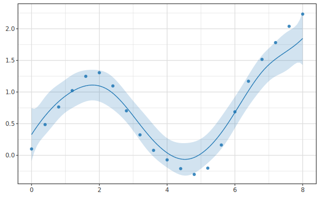

# Generalized Additive Model (GAM)

> 🌐 [English](06-gam.md) | **日本語**

> 各説明変数を個別の滑らかな関数で表現する加法モデル。
> 解釈性 + 非線形性のバランス。`Hanalyze.Model.GAM` モジュール。
>
> 関連: [06-quantile.ja.md](06-quantile.ja.md) / [04-spline.ja.md](04-spline.ja.md)


## 何のために使うか

LM (線形回帰) は線形性を仮定する。Spline は 1 変数の非線形性を扱える。
GAM はこれを **多変数で加法的に** 拡張:

$$ y = \beta_0 + \sum_{j=1}^{p} s_j(x_j) + \varepsilon $$

各 $s_j$ は変数 $x_j$ の **滑らかな関数**。

応用例:
- **疫学**: 年齢 + BMI + 喫煙年数 がそれぞれ非線形に死亡率に寄与
- **環境**: 気温 + 湿度 + 風速 がそれぞれ非線形に大気汚染指数に寄与
- **マーケティング**: 価格 + 広告費 + 季節 が非線形に売上に寄与

GAM の利点:
- **解釈性**: 各 $s_j$ をプロットすると因子の効果が一目瞭然
- **柔軟性**: 関数形を仮定しない (B-spline で自動推定)
- **加法性**: 多次元交互作用は表現できないが、その分過学習しにくい

## アルゴリズム

各特徴 $x_j$ について B-spline 基底 $B_j(x_j)$ (次数 d、ノット K 個) を構築。
統合計画行列:

$$ X = [\mathbf{1} \mid B_1 \mid B_2 \mid \ldots \mid B_p] $$

Ridge 正則化付き最小二乗 (intercept 列はペナルティ免除):

$$ \beta = (X^T X + \lambda S)^{-1} X^T y, \quad S = \text{diag}(0, 1, 1, \ldots) $$

各 $B_j$ は **列平均で中央化** (列ごとに平均を引く) → 識別性確保。
$\beta_0$ は y の平均を表し、$s_j$ は変動成分のみ。

予測:

$$ \hat{y}(x) = \beta_0 + \sum_j s_j(x_j) $$

各 $s_j(x)$ は単独でも取り出せる (`predictGAMComponent`) → **partial effect** の可視化。

## ライブラリ API

```haskell
import Hanalyze.Model.GAM

data GAMFit = GAMFit
  { gamDegree    :: Int
  , gamKnots     :: [[Double]]            -- 各特徴のノット
  , gamBetas     :: [Vector Double]        -- 各特徴の spline 係数
  , gamColMeans  :: [Vector Double]        -- 列平均 (中央化用)
  , gamIntercept :: Double
  , gamYHat      :: Vector Double
  , gamResid     :: Vector Double
  , gamR2        :: Double
  , gamLambda    :: Double
  }

fitGAM :: Int                  -- B-spline degree (3 推奨)
       -> Int                  -- 内部ノット数 (5 程度から開始)
       -> Double               -- Ridge λ (0.01 程度)
       -> [V.Vector Double]    -- 説明変数
       -> V.Vector Double      -- y
       -> GAMFit

predictGAM :: GAMFit -> [V.Vector Double] -> V.Vector Double

predictGAMComponent :: GAMFit -> Int -> V.Vector Double -> V.Vector Double
-- ^ j 番目の特徴の partial effect s_j(x_j) のみ
```

## 使用例

```haskell
{-# LANGUAGE OverloadedStrings #-}
import qualified Data.Vector as V
import Hanalyze.Model.GAM

main :: IO ()
main = do
  let n = 100
      xs1 = V.fromList [ fromIntegral i / 10 | i <- [0..n-1] ]
      xs2 = V.fromList [ sin (fromIntegral i / 5) | i <- [0..n-1] ]
      ys  = V.fromList [ x1 * x1 + sin (3 * x2)   -- 非線形+非線形
                       | (x1, x2) <- zip (V.toList xs1) (V.toList xs2) ]
      fit = fitGAM 3 8 0.01 [xs1, xs2] ys
  putStrLn $ "Intercept: " ++ show (gamIntercept fit)
  putStrLn $ "R²:        " ++ show (gamR2 fit)

  -- 各特徴の partial effect を取り出す
  let s1 = predictGAMComponent fit 0 xs1   -- s_1(x_1)
      s2 = predictGAMComponent fit 1 xs2   -- s_2(x_2)
  -- s1 / s2 をプロットすれば各因子の非線形効果が見える
  putStrLn $ "s_1 range: " ++ show (V.minimum s1, V.maximum s1)
```

`predictGAMComponent` で取り出した各 $s_j$ を描くと、その変数の非線形効果
(加法平滑曲線) を散布図上で確認できる。これが GAM の解釈性の核となる出力。



## CLI

```bash
hanalyze gam data.csv "x1 x2 x3" y \
    --knots 8 \
    --lambda 0.05 \
    --report
```

レポートには **各特徴の partial effect** が個別セクションで描画される
(partial residual + smooth curve)。

## Reportable による可視化

現状 `Reportable GAMFit` 未提供。CLI ハンドラを参考に独自構築:

```haskell
import qualified Hanalyze.Viz.ReportBuilder as RB

let baseSec = [ RB.secDataOverview df xCols yCol
              , RB.secModelOverview "GAM" formula Nothing
              , RB.secKeyValue "Fit summary"
                  [ ("Degree",   T.pack (show (gamDegree fit)))
                  , ("Knots",    T.pack (show ...))
                  , ("Intercept",T.pack (printf "%.4f" (gamIntercept fit)))
                  , ("R²",       T.pack (printf "%.4f" (gamR2 fit)))
                  ]
              ]
    -- Partial effects
    partialSec j c xVec =
      RB.secVega ("Partial effect: s(" <> c <> ")") (mySpec j c xVec)
    -- ↑ mySpec は app/Main.hs の gamPartialSpec を参考に作成
```

## 注意点

- **過学習リスク**: ノット数 K を大きくすると過学習しやすい。λ で正則化、
  または K を 5-10 程度に抑える。
- **加法性の仮定**: $s_j(x_j) \cdot s_k(x_k)$ のような交互作用は表現できない。
  必要なら `Hanalyze.Model.Spline` で 2D テンソル積基底を別途構築するか、Random Forest
  / Gradient Boosting に切り替える。
- **外挿は危険**: 訓練範囲外の x で各 $s_j$ は非自然な振動をすることがある。

---


---

## 関連リンク

- 線形回帰: [01-lm.ja.md](01-lm.ja.md)
- 正則化: [04-regularized.ja.md](04-regularized.ja.md)
- 理論背景: [theory-regression-extensions.ja.md](theory-regression-extensions.ja.md)
