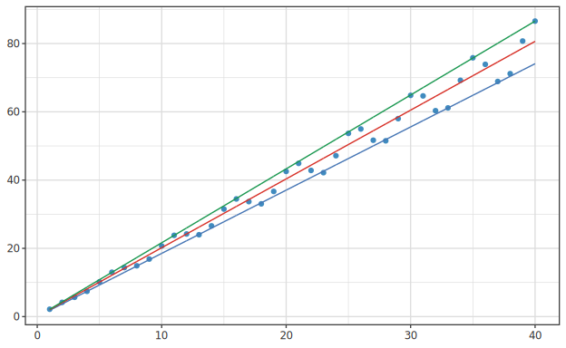

# Quantile Regression

> 🌐 **English** | [日本語](06-quantile.ja.md)

> A technique that directly fits τ-quantiles. For predicting medians, quartiles, and extreme regions.
> `Hanalyze.Model.Quantile` module.
>
> Related: [06-gam.md](06-gam.md) (additive models) / [06-randomforest.md](06-randomforest.md)


## Why Use It?

Ordinary OLS fits the **mean**, while quantile regression fits the τ-quantile (τ ∈ (0, 1)):

| τ | Estimation target |
|---|---|
| 0.5 | **Median** (resistant to outliers) |
| 0.1 / 0.9 | Lower/upper prediction interval |
| 0.05 / 0.95 | Wider prediction interval |

Applications:
- **Income distribution**: Model median income and top 10% income separately
- **Healthcare**: 5th/50th/95th percentile curves of children's height
- **Power demand**: Modeling peak demand (95th percentile)
- **Finance**: VaR (Value at Risk = 1st percentile of loss)

## Loss Function — Pinball Loss

Ordinary OLS minimizes squared error Σ r². Quantile regression uses **asymmetric absolute error**:

$$ \rho_\tau(u) = u\,(\tau - \mathbb{1}[u < 0]) = \begin{cases} \tau u   & u \ge 0 \\ (\tau - 1) u & u < 0 \end{cases} $$

This is called pinball loss or check loss. At τ=0.5 it equals the standard absolute error |u|/2,
matching median estimation. At τ=0.9, the asymmetric loss "weights positive residuals 0.9×, negative 0.1×",
estimating the **upper quantile**.

## Algorithm — MM-IRLS (Hunter-Lange)

|u| is not differentiable, so we approximate iteratively using quadratic functions (Majorization-Minimization):

$$ |u| \le \frac{u^2 + u_k^2}{2|u_k|}  \quad \text{(equality at } u = u_k \text{)} $$

Using this, we replace the pinball loss with a quadratic function, reducing to **weighted least squares**:

1. β₀ = initialized with OLS solution
2. Iteration k:
   - r = y - X β_k
   - w_i = 1 / (2 max(|r_i|, ε))
   - y'_i = y_i + (τ - 0.5) / w_i
   - β_{k+1} = (Xᵀ W X)⁻¹ Xᵀ W y'
3. Stop when ||β_{k+1} - β_k|| < tol

Implemented in `Hanalyze.Model.Quantile.fitQuantile`. Max 100 iterations, tol 1e-7.

## Evaluation Metric — Pseudo R¹_τ (Koenker-Machado 1999)

Ordinary R² is mean-based and unsuitable for quantile regression. Instead:

$$ R^1_\tau = 1 - \frac{V_\tau(\text{model})}{V_\tau(\text{intercept-only})} $$

where $V_\tau(m) = \Sigma \rho_\tau(r_i)$. Range is (-∞, 1], 0 means intercept-only equivalence, 1 is perfect fit.

## Library API

```haskell
import Hanalyze.Model.Quantile

data QRFit = QRFit
  { qfTau     :: Double
  , qfBeta    :: Vector Double
  , qfYHat    :: Vector Double
  , qfResid   :: Vector Double
  , qfPinball :: Double         -- Σ ρ_τ(r_i)
  , qfR1      :: Double         -- Pseudo R¹_τ
  , qfIters   :: Int
  }

fitQuantile :: Double          -- τ ∈ (0, 1)
            -> Matrix Double   -- X (with intercept column)
            -> Vector Double   -- y
            -> QRFit

predictQuantile :: QRFit -> Matrix Double -> Vector Double

pinballLoss :: Double -> [Double] -> Double      -- For individual computation
pseudoR1    :: Double -> Double -> Double        -- modelV, baseV → R¹_τ
```

## Usage Example

```haskell
{-# LANGUAGE OverloadedStrings #-}
import qualified Numeric.LinearAlgebra as LA
import qualified Data.Vector as V
import Hanalyze.Model.Quantile

main :: IO ()
main = do
  let xs = V.fromList [1, 2, 3, 4, 5, 6, 7, 8, 9, 10 :: Double]
      ys = V.fromList [2.1, 3.5, 4.8, 6.2, 7.9, 9.1, 10.5, 11.8, 13.2, 14.5]
      n  = V.length xs
      xMat = LA.fromColumns
               [ LA.konst 1 n
               , LA.fromList (V.toList xs) ]
      yLA  = LA.fromList (V.toList ys)
      fitMed  = fitQuantile 0.5  xMat yLA   -- Median
      fitLow  = fitQuantile 0.1  xMat yLA   -- Lower 10%
      fitHigh = fitQuantile 0.9  xMat yLA   -- Upper 90%
  putStrLn $ "Median: "    ++ show (LA.toList (qfBeta fitMed))
  putStrLn $ "10% bound: " ++ show (LA.toList (qfBeta fitLow))
  putStrLn $ "90% bound: " ++ show (LA.toList (qfBeta fitHigh))
  putStrLn $ "Pseudo R¹ (median): " ++ show (qfR1 fitMed)
```

## CLI

```bash
# Median regression
hanalyze quantile data.csv x y --tau 0.5 --report

# Multiple quantiles overlaid in one chart (10%/50%/90%)
hanalyze quantile data.csv x y --taus 0.1,0.5,0.9 --report
```

When `--taus` is specified, the report adds a **Multiple quantile fits** section
showing observed scatter plus each quantile line color-coded with tableau10 colors.

Overlaying multiple quantile lines on one chart reveals how lines for τ=0.1/0.5/0.9
diverge to the right, the prediction interval width expanding with the predictor:



## Visualization via Reportable

Currently the `Reportable QRFit` instance is not provided (the CLI handler constructs sections directly).
To create an equivalent report from the library:

```haskell
import qualified Hanalyze.Viz.ReportBuilder as RB

let cfg = RB.defaultReportConfig "Quantile demo"
    sections =
      [ RB.secDataOverview df ["x"] "y"
      , RB.secModelOverview "Quantile (τ=0.5)" "Q_τ(y|x) = β₀ + β₁ x" Nothing
      , RB.secCoefficients
          [("intercept", LA.toList (qfBeta fitMed) !! 0)
          ,("β₁",        LA.toList (qfBeta fitMed) !! 1)]
          (Just ("Pseudo R¹_τ", qfR1 fitMed))
      , RB.secKeyValue "Fit summary"
          [ ("τ",            "0.500")
          , ("Pinball loss", T.pack (printf "%.4f" (qfPinball fitMed)))
          , ("Iterations",   T.pack (show (qfIters fitMed)))
          ]
      , RB.secFitScatter "x" "y" xs ys
          (Just (RB.SmoothCurve grid yhat [] []))
      , RB.secResiduals
          (LA.toList (qfYHat fitMed))
          (LA.toList (qfResid fitMed))
      ]
RB.renderReport "out.html" cfg sections
```

## Caveats

- **MM-IRLS is slow**: iterates up to max 100 times. With large data size N,
  the matrix inversion in WLS becomes a bottleneck (O(p³) per iteration).
- **Unstable near τ = 0 / 1**: At τ=0.01 / 0.99, the smoothing effect via ε is large,
  estimation tends to fluctuate.
- **Multivariate extension**: The API above is simple linear quantile p × β. For nonlinear versions,
  construct spline basis separately and pass to fitQuantile.

---


---

## Related Links

- Linear regression: [01-lm.md](01-lm.md)
- Regularization: [04-regularized.md](04-regularized.md)
- Theoretical background: [theory-regression-extensions.md](theory-regression-extensions.md)
