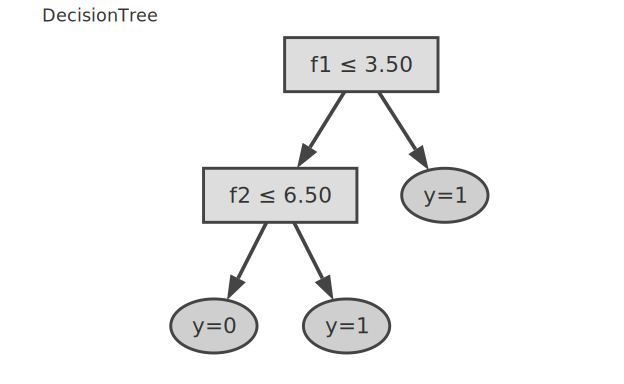

# Model.DecisionTree — 分類用 CART

> sklearn `DecisionTreeClassifier` 相当。
> 回帰は既存の [`Hanalyze.Model.RandomForest`](06-randomforest.ja.md) を参照。

## 1. API

```haskell
data DTree
  = DLeaf
      { dlClassProbs :: Map Int Double  -- class → probability
      , dlMajority   :: Int
      }
  | DNode
      { dnFeature :: Int
      , dnThr     :: Double
      , dnLeft    :: DTree   -- ≤ thr
      , dnRight   :: DTree   -- > thr
      }

data DTConfig = DTConfig
  { dtMaxDepth        :: Maybe Int
  , dtMinSamplesSplit :: Int
  , dtMinSamplesLeaf  :: Int
  , dtMinImpurity     :: Double
  }

fitDT          :: DTConfig -> [[Double]] -> [Int] -> DTree
predictDT      :: DTree -> [Double] -> Int
predictDTProbs :: DTree -> [Double] -> Map Int Double
```

## 2. 使用例

```haskell
import qualified Hanalyze.Model.DecisionTree as DT

-- iris like データ
let xs = [[5.1, 3.5, 1.4, 0.2], [4.9, 3.0, 1.4, 0.2], ...]
    ys = [0, 0, 1, 1, 2, 2, ...]

let tree = DT.fitDT DT.defaultDTConfig xs ys

-- 予測
DT.predictDT tree [5.0, 3.4, 1.5, 0.2]   -- :: Int
DT.predictDTProbs tree [5.0, 3.4, 1.5, 0.2]
-- fromList [(0, 0.95), (1, 0.05), (2, 0.0)]
```

## 3. ハイパーパラメータの設定

| パラメータ | デフォルト | 効果 |
|---|---|---|
| `dtMaxDepth` | `Nothing` (∞) | 深く → 過学習。`Just 5` で抑制 |
| `dtMinSamplesSplit` | 2 | 分割するノード最小サンプル |
| `dtMinSamplesLeaf` | 1 | leaf 最小サンプル数 |
| `dtMinImpurity` | 0 | 分割を試みる最小 Gini impurity |

```haskell
-- 過学習対策
let cfg = DT.defaultDTConfig
            { DT.dtMaxDepth = Just 5
            , DT.dtMinSamplesLeaf = 5
            }
```

## 4. アルゴリズム

CART (Classification And Regression Trees, Breiman et al. 1984):
- **基準**: Gini impurity = 1 - Σ p_i²
- **分割探索**: 全 feature × 全 threshold 候補で gain 最大化
- **threshold**: 隣接相異値の中点
- **再帰**: stop 条件まで深さ優先で構築

構築された木は樹形図で可視化できる。矩形が分割ノード (例 `f1 ≤ 3.50`)、
楕円が葉ノード (予測クラス `y=0/1`) を表す:



## 5. アンサンブル

複数木でバギング:
- 既存 `Hanalyze.Model.RandomForest` (回帰のみ) を参考に
- 分類 RF は `fitDT` を bootstrap × random feature subset で複数構築可能 (将来実装)

## 6. 注意

- **特徴量スケーリング不要** (距離ベースでなく分割ベース)
- **欠損値非対応**: 事前に `imputeMean` 等で埋める
- **多クラス対応済**: ラベル整数で OK
