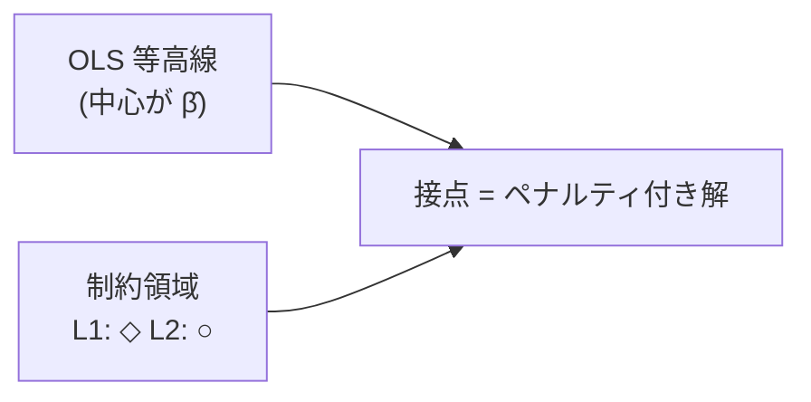
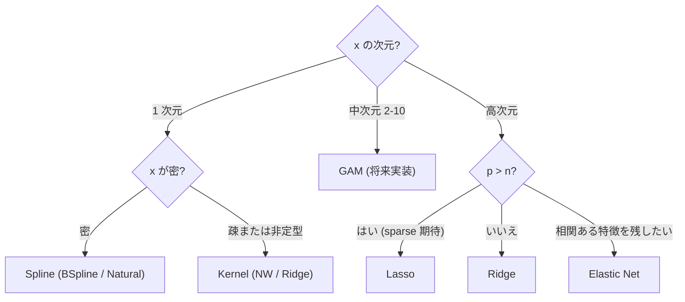

# 学習資料 6 — 回帰拡張の理論

> Spline / Kernel / Regularized 回帰の数学的背景と直観。
> 使い方は [docs/regression/04-regularized.ja.md](04-regularized.ja.md)。

## 1. 線形回帰の限界と拡張の方向

### 1.1 OLS のおさらい

線形回帰 $y = X\beta + \varepsilon$ で $\hat\beta = (X^T X)^{-1} X^T y$ は:

- **Gauss-Markov の定理**: $\varepsilon$ が等分散 + 無相関なら BLUE (最良線形不偏推定量)
- **問題点**:
  1. 線形性の仮定が破れると bias が大
  2. $X^T X$ が ill-conditioned (条件数大) だと推定が不安定
  3. $p > n$ なら $X^T X$ が rank deficient で逆行列存在せず

### 1.2 拡張の方向

| 限界 | 解決策 | hanalyze API |
|---|---|---|
| 非線形性 | 基底拡張 (多項式・スプライン) | `Hanalyze.Model.Spline` |
| 関数形不明 | カーネル法 | `Hanalyze.Model.Kernel` |
| 高次元・共線性 | 正則化 | `Hanalyze.Model.Regularized` |
| 局所構造 | カーネル / GP | `Hanalyze.Model.Kernel`, `Hanalyze.Model.GP` |

---

## 2. Bias-Variance Tradeoff

任意の推定量 $\hat f(x)$ について:

$$ E[(y - \hat f(x))^2] = \underbrace{(f(x) - E[\hat f(x)])^2}_{\text{Bias}^2}
   + \underbrace{\text{Var}(\hat f(x))}_{\text{Variance}}
   + \underbrace{\sigma^2_\varepsilon}_{\text{Irreducible}} $$

複雑度を制御する手段:
- **Spline**: ノット数
- **Kernel**: bandwidth $h$
- **Regularized**: ペナルティ $\lambda$

これらすべて **CV (k-fold cross-validation)** で最適パラメタを選ぶ。

---

## 3. スプライン回帰 (Spline)

### 3.1 動機

「滑らかな」関数を限られた基底関数の線形結合で表現する:

$$ \hat f(x) = \sum_{j=1}^J \beta_j B_j(x) $$

$B_j$ は **基底関数** (basis function)。

### 3.2 区分多項式と滑らかさ

**ノット** $\xi_1 < \xi_2 < \cdots < \xi_K$ で区切られた区間それぞれに
多項式を当てる。各ノットで:

- **連続**: $C^0$ (値が連続)
- **滑らか**: $C^1$ (1 次微分連続)
- **二度滑らか**: $C^2$ (2 次微分連続) ← cubic spline

### 3.3 B-spline 基底 (Cox-de Boor 再帰)

次数 $k$ の B-spline は次の再帰で定義:

$$ B_{i,0}(x) = \begin{cases} 1 & t_i \le x < t_{i+1} \\ 0 & \text{otherwise} \end{cases} $$

$$ B_{i,k}(x) = \frac{x - t_i}{t_{i+k} - t_i} B_{i,k-1}(x)
             + \frac{t_{i+k+1} - x}{t_{i+k+1} - t_{i+1}} B_{i+1,k-1}(x) $$

性質:
- **コンパクトサポート**: $B_{i,k}$ は $[t_i, t_{i+k+1}]$ の外で 0
- 各 $x$ で **多くて $k+1$ 個** の基底が非ゼロ → 計算効率
- 単位分割: $\sum_i B_{i,k}(x) = 1$ (clamped knots)

### 3.4 自然立方スプライン

**境界外で線形** (= 二階微分が 0)。$N$ 個のノットで $N$ 個の基底:

$$ N_1(x) = 1, \quad N_2(x) = x $$
$$ N_{k+2}(x) = d_k(x) - d_{N-1}(x), \quad k = 1, \ldots, N-2 $$
$$ d_k(x) = \frac{(x - \xi_k)^3_+ - (x - \xi_N)^3_+}{\xi_N - \xi_k} $$

外挿で爆発しないので、**信頼できる予測範囲が広い**。

### 3.5 ノット選び

| 戦略 | 利点 | 欠点 |
|---|---|---|
| 等間隔 | シンプル | 偏在データで非効率 |
| 分位点ベース | 各ビン同サンプル | 外れ値の影響 |
| Free knots | 最適配置 | 複雑な最適化 |
| Penalized spline | 多めのノット + 平滑化罰則 | λ 選び |

---

## 4. カーネル法

### 4.1 Nadaraya-Watson

$$ \hat f(x) = \frac{\sum_i K_h(x - x_i) y_i}{\sum_i K_h(x - x_i)} $$

これは「**重み付き移動平均**」: 近傍点ほど大きい重み $K_h(x-x_i)$。

### 4.2 カーネル関数の例

| カーネル | $K(u)$ | サポート |
|---|---|---|
| Gaussian | $\frac{1}{\sqrt{2\pi}} e^{-u^2/2}$ | $\mathbb{R}$ |
| Epanechnikov | $\frac{3}{4}(1 - u^2)$ | $|u| \le 1$ |
| TriCube | $(1 - |u|^3)^3$ | $|u| \le 1$ |
| Triangular | $1 - |u|$ | $|u| \le 1$ |
| Uniform | $\frac{1}{2}$ | $|u| \le 1$ |

理論的に **Epanechnikov** が AMISE (asymptotic mean integrated squared error) 最小だが、
実用上は差はわずか。

### 4.3 Bandwidth $h$ のトレードオフ

$$ \text{MISE}(h) = \underbrace{\frac{R(K)}{nh}}_{\text{Variance}}
                  + \underbrace{\frac{1}{4} h^4 R(f'') \mu_2(K)^2}_{\text{Bias}^2} $$

最適 $h^* \propto n^{-1/5}$ (1 次元の場合)。実用的には:
- **Silverman's rule**: $h = 1.06 \hat\sigma n^{-1/5}$
- **LOO-CV**: 直接データから選ぶ (`gridSearchBandwidth`)

### 4.4 Kernel Ridge Regression

NW を一般化。RKHS (Reproducing Kernel Hilbert Space) で定式化:

$$ \min_f \frac{1}{n} \sum_i (y_i - f(x_i))^2 + \lambda \|f\|_\mathcal{H}^2 $$

Representer theorem: 解は $\hat f(x) = \sum_i \alpha_i K(x, x_i)$ の形で書け、

$$ \boldsymbol\alpha = (K + \lambda I)^{-1} \mathbf{y} $$

ここで $K_{ij} = K(x_i, x_j)$ は Gram 行列。

| 比較 | NW | Kernel Ridge | GP |
|---|---|---|---|
| 不確実性 | × | × | ○ |
| 計算量 | $O(n)$ /予測 | $O(n^3)$ 一回 + $O(n)$/予測 | $O(n^3)$ |
| ハイパーパラメタ | $h$ | $h, \lambda$ | $h, \sigma_n^2$ + 事後 |

---

## 5. 正則化 (Regularization)

### 5.1 動機

$X^T X$ が ill-conditioned のとき、$\hat\beta$ は分散が大。**罰則項** で
shrink:

$$ \hat\beta = \arg\min_\beta \|\mathbf y - X\beta\|^2 + \lambda \, P(\beta) $$

$P(\beta)$ がペナルティ関数。

### 5.2 Ridge (L2)

$$ P(\beta) = \|\beta\|_2^2 = \sum \beta_j^2 $$

**閉形式**:

$$ \hat\beta_\text{Ridge} = (X^T X + \lambda I)^{-1} X^T \mathbf y $$

性質:
- 全 $\beta_j$ が $1/(1 + \lambda)$ 程度に縮小
- **ゼロにはならない** (連続的に縮小)
- 多重共線性で安定

### 5.3 Lasso (L1)

$$ P(\beta) = \|\beta\|_1 = \sum |\beta_j| $$

**閉形式なし**。代表的な最適化: **Coordinate Descent**:

各 $j$ について他の $\beta_{-j}$ を固定して解析解:

$$ \rho_j = \frac{1}{n} X_j^T (\mathbf y - X_{-j}\beta_{-j}) $$

$$ \hat\beta_j = \frac{S(\rho_j, \lambda)}{\frac{1}{n} \|X_j\|^2} $$

ここで **soft-thresholding 関数**:

$$ S(z, \gamma) = \text{sign}(z) \max(|z| - \gamma, 0) $$

性質:
- 一部の $\beta_j$ が **厳密にゼロ** (= 変数選択!)
- 相関ある特徴量から **1 つだけ** 残しがち (=バイアス)

### 5.4 Elastic Net

L1 + L2 の混合:

$$ P(\beta) = \lambda_1 \|\beta\|_1 + \frac{\lambda_2}{2} \|\beta\|_2^2 $$

Coordinate Descent:

$$ \hat\beta_j = \frac{S(\rho_j, \lambda_1)}{\frac{1}{n} \|X_j\|^2 + \lambda_2} $$

性質:
- L1 → 変数選択
- L2 → 相関ある特徴をグループとして残す
- 最良の混合 (Zou & Hastie 2005)

### 5.5 幾何学的解釈

- **L2** の制約領域は球 → 接点は通常内点 (全 $\beta$ 非ゼロ)
- **L1** の制約領域は ◇ → 角で接しやすい → ゼロ係数が出やすい

### 5.6 標準化の重要性

ペナルティはスケール依存:

$$ \lambda |\beta_j| = \lambda \cdot \beta_j^* \cdot \sigma_j $$

→ 列 $j$ を標準化 ($\sigma_j = 1$) しないと、スケール大の列ほどペナルティが軽くなる。
**Lasso/Elastic Net は事前に standardize する** のが標準。

### 5.7 Bayesian 解釈

| 罰則 | 対応する事前 |
|---|---|
| L2 (Ridge) | $\beta_j \sim \text{Normal}(0, \tau^2)$, $\lambda = 1/\tau^2$ |
| L1 (Lasso) | $\beta_j \sim \text{Laplace}(0, b)$, $\lambda = 1/b$ |
| Elastic Net | Laplace × Normal の積 |

→ `Hanalyze.Model.HBM` の `potential` プリミティブでカスタム罰則を表現可能。

---

## 6. CV と $\lambda$ 選択

### 6.1 k-fold CV

データを $k$ 分割。各 fold を test、残りで train。

$$ \text{CV}(\lambda) = \frac{1}{k} \sum_{f=1}^k \text{MSE}_\text{test}(f, \lambda) $$

最適 $\lambda^* = \arg\min_\lambda \text{CV}(\lambda)$。

### 6.2 1 SE rule

最小値 + 標準誤差以内で **最も罰則が強い** $\lambda$ を選ぶ
(よりロバスト、Tibshirani 推奨)。

### 6.3 LOO-CV

$k = n$。Ridge には閉形式 (PRESS):

$$ \text{LOO}(\lambda) = \frac{1}{n} \sum_i \left(\frac{y_i - \hat y_i}{1 - h_{ii}}\right)^2 $$

ここで $h_{ii}$ は hat matrix の対角。

---

## 7. 多次元への拡張

### 7.1 多次元 Spline (Tensor product)

$x \in \mathbb{R}^d$ で:

$$ B_{i_1, i_2, \ldots, i_d}(x) = \prod_{l=1}^d B_{i_l}^{(l)}(x_l) $$

基底数が $J^d$ で爆発 → **GAM** で和に分解:

$$ \hat f(x) = \sum_{l=1}^d f_l(x_l) $$

各 $f_l$ をスプラインで。

### 7.2 多次元カーネル

$$ K_h(x, x') = \prod_{l=1}^d K_{h_l}(x_l - x'_l) $$

bandwidth は次元ごとに別。**次元の呪い**: $h^* \propto n^{-1/(d+4)}$ で
$d$ が大きいと収束遅。

### 7.3 多次元正則化

X が高次元なら **そのまま** Ridge/Lasso を適用すれば OK
(p > n も扱える)。

---

## 8. 実務上の選び方

---

## 9. 参考文献

- Hastie, Tibshirani, Friedman: *Elements of Statistical Learning* (2009) — 第 3 章 (正則化), 第 5 章 (スプライン), 第 6 章 (カーネル)
- de Boor: *A Practical Guide to Splines* (2001)
- Tibshirani: "Regression Shrinkage and Selection via the Lasso" (1996)
- Zou & Hastie: "Regularization and Variable Selection via the Elastic Net" (2005)
