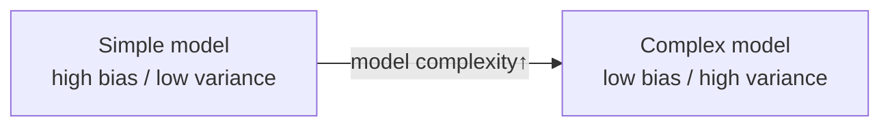
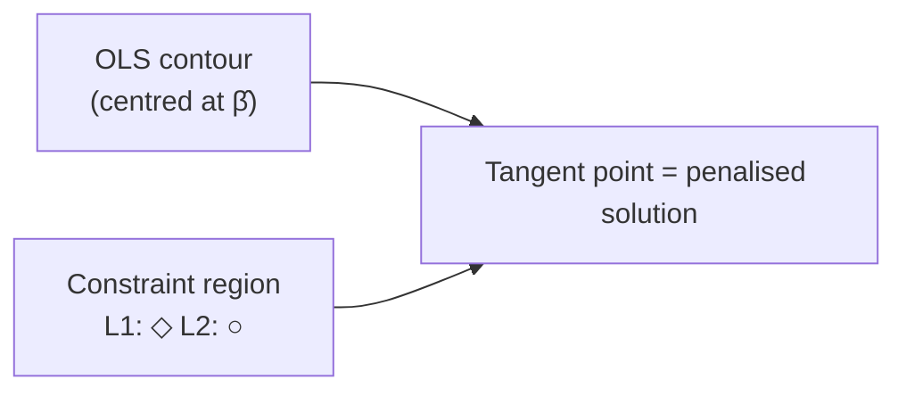
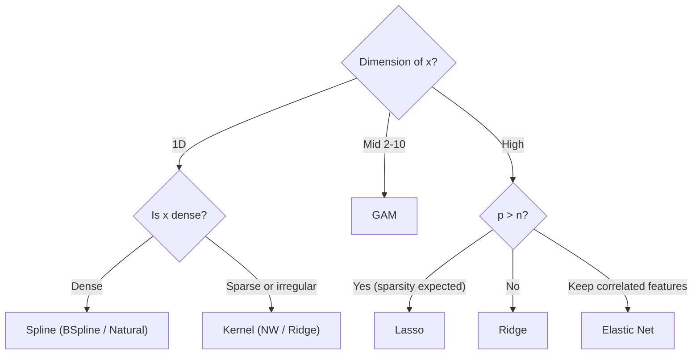

# Study Material 6 — Theory of regression extensions

> 🌐 **English** | [日本語](theory-regression-extensions.ja.md)

> Mathematical background and intuition for spline / kernel / regularized regression.
> Practical usage: [docs/regression/04-regularized.md](04-regularized.md).

## 1. Limitations of linear regression and directions for extension

### 1.1 OLS recap

For linear regression $y = X\beta + \varepsilon$, $\hat\beta = (X^T X)^{-1} X^T y$:

- **Gauss–Markov theorem**: BLUE (best linear unbiased estimator) when $\varepsilon$ is homoscedastic and uncorrelated.
- **Limitations**:
  1. Large bias when linearity fails.
  2. Unstable estimates when $X^T X$ is ill-conditioned.
  3. Rank-deficient $X^T X$ (no inverse) when $p > n$.

### 1.2 Direction of extensions

| Limitation | Resolution | hanalyze API |
|---|---|---|
| Nonlinearity | Basis expansion (polynomial, spline) | `Model.Spline` |
| Unknown functional form | Kernel methods | `Model.Kernel` |
| High dimensionality / collinearity | Regularization | `Model.Regularized` |
| Local structure | Kernel / GP | `Model.Kernel`, `Model.GP` |

---

## 2. Bias–variance trade-off

For any estimator $\hat f(x)$:

$$ E[(y - \hat f(x))^2] = \underbrace{(f(x) - E[\hat f(x)])^2}_{\text{Bias}^2}
   + \underbrace{\text{Var}(\hat f(x))}_{\text{Variance}}
   + \underbrace{\sigma^2_\varepsilon}_{\text{Irreducible}} $$

Knobs that control complexity:
- **Spline**: number of knots
- **Kernel**: bandwidth $h$
- **Regularized**: penalty $\lambda$

All three select the optimal value via **k-fold cross-validation**.

---

## 3. Spline regression

### 3.1 Motivation

Represent a "smooth" function as a linear combination of a small number of basis functions:

$$ \hat f(x) = \sum_{j=1}^J \beta_j B_j(x) $$

where $B_j$ are **basis functions**.

### 3.2 Piecewise polynomials and smoothness

Fit a polynomial within each interval delimited by **knots** $\xi_1 < \xi_2 < \cdots < \xi_K$. At each knot:

- **Continuous**: $C^0$ (value is continuous)
- **Smooth**: $C^1$ (1st derivative continuous)
- **Doubly smooth**: $C^2$ (2nd derivative continuous) — cubic spline

### 3.3 B-spline basis (Cox–de Boor recursion)

A degree-$k$ B-spline is defined by the recursion:

$$ B_{i,0}(x) = \begin{cases} 1 & t_i \le x < t_{i+1} \\ 0 & \text{otherwise} \end{cases} $$

$$ B_{i,k}(x) = \frac{x - t_i}{t_{i+k} - t_i} B_{i,k-1}(x)
             + \frac{t_{i+k+1} - x}{t_{i+k+1} - t_{i+1}} B_{i+1,k-1}(x) $$

Properties:
- **Compact support**: $B_{i,k}$ is zero outside $[t_i, t_{i+k+1}]$.
- For each $x$ at most **$k+1$** basis functions are non-zero → efficient to evaluate.
- Partition of unity: $\sum_i B_{i,k}(x) = 1$ (clamped knots).

### 3.4 Natural cubic spline

**Linear beyond the boundary** (i.e. zero second derivative). $N$ knots give $N$ basis functions:

$$ N_1(x) = 1, \quad N_2(x) = x $$
$$ N_{k+2}(x) = d_k(x) - d_{N-1}(x), \quad k = 1, \ldots, N-2 $$
$$ d_k(x) = \frac{(x - \xi_k)^3_+ - (x - \xi_N)^3_+}{\xi_N - \xi_k} $$

Won't blow up when extrapolating, so the **trustworthy prediction range is wider**.

### 3.5 Knot placement

| Strategy | Pro | Con |
|---|---|---|
| Equispaced | Simple | Inefficient on skewed data |
| Quantile-based | Equal samples per bin | Sensitive to outliers |
| Free knots | Optimal placement | Complex optimisation |
| Penalised spline | Many knots + smoothing penalty | λ selection |

---

## 4. Kernel methods

### 4.1 Nadaraya–Watson

$$ \hat f(x) = \frac{\sum_i K_h(x - x_i) y_i}{\sum_i K_h(x - x_i)} $$

A **weighted moving average**: nearby points carry larger weight $K_h(x-x_i)$.

### 4.2 Examples of kernel functions

| Kernel | $K(u)$ | Support |
|---|---|---|
| Gaussian | $\frac{1}{\sqrt{2\pi}} e^{-u^2/2}$ | $\mathbb{R}$ |
| Epanechnikov | $\frac{3}{4}(1 - u^2)$ | $|u| \le 1$ |
| TriCube | $(1 - |u|^3)^3$ | $|u| \le 1$ |
| Triangular | $1 - |u|$ | $|u| \le 1$ |
| Uniform | $\frac{1}{2}$ | $|u| \le 1$ |

In theory **Epanechnikov** minimises AMISE (asymptotic mean integrated squared error), but in practice the differences are negligible.

### 4.3 Bandwidth $h$ trade-off

$$ \text{MISE}(h) = \underbrace{\frac{R(K)}{nh}}_{\text{Variance}}
                  + \underbrace{\frac{1}{4} h^4 R(f'') \mu_2(K)^2}_{\text{Bias}^2} $$

Optimal $h^* \propto n^{-1/5}$ (1D case). Practical choices:
- **Silverman's rule**: $h = 1.06 \hat\sigma n^{-1/5}$
- **LOO-CV**: pick directly from the data (`gridSearchBandwidth`)

### 4.4 Kernel Ridge Regression

A generalisation of NW. Formulated in an RKHS (Reproducing Kernel Hilbert Space):

$$ \min_f \frac{1}{n} \sum_i (y_i - f(x_i))^2 + \lambda \|f\|_\mathcal{H}^2 $$

By the representer theorem the solution is $\hat f(x) = \sum_i \alpha_i K(x, x_i)$, and

$$ \boldsymbol\alpha = (K + \lambda I)^{-1} \mathbf{y} $$

where $K_{ij} = K(x_i, x_j)$ is the Gram matrix.

| Comparison | NW | Kernel Ridge | GP |
|---|---|---|---|
| Uncertainty | × | × | ○ |
| Cost | $O(n)$ /pred | $O(n^3)$ once + $O(n)$/pred | $O(n^3)$ |
| Hyperparameters | $h$ | $h, \lambda$ | $h, \sigma_n^2$ + posterior |

---

## 5. Regularization

### 5.1 Motivation

When $X^T X$ is ill-conditioned, $\hat\beta$ has large variance. **Penalty terms** shrink it:

$$ \hat\beta = \arg\min_\beta \|\mathbf y - X\beta\|^2 + \lambda \, P(\beta) $$

with $P(\beta)$ a penalty function.

### 5.2 Ridge (L2)

$$ P(\beta) = \|\beta\|_2^2 = \sum \beta_j^2 $$

**Closed form**:

$$ \hat\beta_\text{Ridge} = (X^T X + \lambda I)^{-1} X^T \mathbf y $$

Properties:
- Every $\beta_j$ shrinks roughly by a factor $1/(1 + \lambda)$.
- **Never exactly zero** (continuous shrinkage).
- Stable under multicollinearity.

### 5.3 Lasso (L1)

$$ P(\beta) = \|\beta\|_1 = \sum |\beta_j| $$

**No closed form**. The standard optimiser is **coordinate descent**:

For each $j$, holding the other $\beta_{-j}$ fixed, the analytical solution is

$$ \rho_j = \frac{1}{n} X_j^T (\mathbf y - X_{-j}\beta_{-j}) $$

$$ \hat\beta_j = \frac{S(\rho_j, \lambda)}{\frac{1}{n} \|X_j\|^2} $$

with the **soft-thresholding function**:

$$ S(z, \gamma) = \text{sign}(z) \max(|z| - \gamma, 0) $$

Properties:
- Some $\beta_j$ are **exactly zero** (= variable selection).
- Tends to keep **only one** of correlated features (= bias).

### 5.4 Elastic Net

A mixture of L1 and L2:

$$ P(\beta) = \lambda_1 \|\beta\|_1 + \frac{\lambda_2}{2} \|\beta\|_2^2 $$

Coordinate descent:

$$ \hat\beta_j = \frac{S(\rho_j, \lambda_1)}{\frac{1}{n} \|X_j\|^2 + \lambda_2} $$

Properties:
- L1 → variable selection.
- L2 → keeps correlated features as a group.
- Best of both (Zou & Hastie 2005).

### 5.5 Geometric interpretation

- **L2** constraint region is a sphere → tangent typically interior (all $\beta$ non-zero).
- **L1** region is a diamond → tends to touch on a corner → zero coefficients appear.

### 5.6 Importance of standardisation

Penalties are scale-dependent:

$$ \lambda |\beta_j| = \lambda \cdot \beta_j^* \cdot \sigma_j $$

→ Without standardising column $j$ ($\sigma_j = 1$), large-scale columns receive a smaller effective penalty. **It is standard to standardise before Lasso/Elastic Net**.

### 5.7 Bayesian interpretation

| Penalty | Corresponding prior |
|---|---|
| L2 (Ridge) | $\beta_j \sim \text{Normal}(0, \tau^2)$, $\lambda = 1/\tau^2$ |
| L1 (Lasso) | $\beta_j \sim \text{Laplace}(0, b)$, $\lambda = 1/b$ |
| Elastic Net | Product of Laplace × Normal |

→ Custom penalties can be expressed via the `potential` primitive in `Model.HBM`.

---

## 6. CV and $\lambda$ selection

### 6.1 k-fold CV

Split data into $k$ folds. Hold out each fold for testing, train on the rest.

$$ \text{CV}(\lambda) = \frac{1}{k} \sum_{f=1}^k \text{MSE}_\text{test}(f, \lambda) $$

Pick $\lambda^* = \arg\min_\lambda \text{CV}(\lambda)$.

### 6.2 1-SE rule

Pick the **most strongly penalised** $\lambda$ within one standard error of the minimum
(more robust; recommended by Tibshirani).

### 6.3 LOO-CV

$k = n$. For Ridge there is a closed form (PRESS):

$$ \text{LOO}(\lambda) = \frac{1}{n} \sum_i \left(\frac{y_i - \hat y_i}{1 - h_{ii}}\right)^2 $$

where $h_{ii}$ is the diagonal of the hat matrix.

---

## 7. Multi-dimensional extensions

### 7.1 Multi-dimensional spline (tensor product)

For $x \in \mathbb{R}^d$:

$$ B_{i_1, i_2, \ldots, i_d}(x) = \prod_{l=1}^d B_{i_l}^{(l)}(x_l) $$

The number of bases blows up as $J^d$. **GAMs** decompose into a sum:

$$ \hat f(x) = \sum_{l=1}^d f_l(x_l) $$

with each $f_l$ as a spline.

### 7.2 Multi-dimensional kernel

$$ K_h(x, x') = \prod_{l=1}^d K_{h_l}(x_l - x'_l) $$

A separate bandwidth per dimension. **Curse of dimensionality**: $h^* \propto n^{-1/(d+4)}$,
so convergence slows as $d$ grows.

### 7.3 Multi-dimensional regularization

For high-dimensional X, Ridge/Lasso apply **directly** (handles $p > n$ as well).

---

## 8. Practical selection

---

## 9. References

- Hastie, Tibshirani, Friedman: *Elements of Statistical Learning* (2009) — Ch. 3 (regularization), Ch. 5 (splines), Ch. 6 (kernels).
- de Boor: *A Practical Guide to Splines* (2001).
- Tibshirani: "Regression Shrinkage and Selection via the Lasso" (1996).
- Zou & Hastie: "Regularization and Variable Selection via the Elastic Net" (2005).
