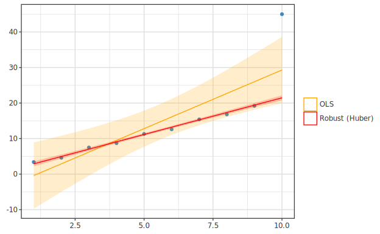

# Generalized Regression advanced + Robust Regression (Phase 31)

> 🌐 **English** | [日本語](usage-regularized-advanced.ja.md)

> Advanced features of penalized regression added in Phase 31 — 
> **Adaptive Lasso / MCP / SCAD / Group Lasso** and **M-estimator robust regression**
> (Huber / Tukey biweight) learning guide. Equivalent to JMP "Generalized Regression" +
> "Robust Fit". Type signatures, minimal examples, and `df |->`/`toPlot` paths are
> documented in [api-guide 02-regression](../api-guide/02-regression.md) as the primary reference.
> This guide covers **penalty formulas, estimation algorithms, and convexity traps**.

---

## 0. Overview

| Feature | Role |
|---|---|
| Adaptive Lasso | Improved true sparsity (oracle property, Zou 2006) |
| MCP | Non-convex penalty, reduces bias on large coefficients vs. Lasso |
| SCAD | Same as above (Fan-Li 2001, 3-region piecewise) |
| Group Lasso | Group-wise selection (multi-level categorical, etc.) |
| Huber M-estimator | Linear regression with outlier-contaminated data |
| Tukey biweight | Complete rejection of outliers when desired |

---

## 1. Adaptive Lasso

Weights `w_j = 1 / |β̂_j^OLS|^γ` (γ=1 typical). Columns with large OLS estimates receive weaker penalties → true zero coefficients are shrunk to zero more aggressively than standard Lasso (oracle property, Zou 2006).

**Implementation**: Column reweighting trick transforms `x_j' = x_j / w_j` → standard Lasso →
recover solution as `β_j = β_j' / w_j`. No extra CD loop needed.

---

## 2. MCP (Minimax Concave Penalty)

```
p(β) = λ|β| - β²/(2γ)   if |β| ≤ γλ
     = γλ²/2            if |β| > γλ
```

`γ → ∞` converges to Lasso, `γ → 1` approaches hard-threshold. Recommended `γ = 3-5`.

**Prerequisite**: `cSq > 1/γ` (automatically satisfied with standardized `Xⱼ` and γ ≥ 3).
If violated, inner CD falls back to OLS solution (no divergence).

---

## 3. SCAD (Smoothly Clipped Absolute Deviation)

Three-region piecewise threshold:

- `|β| ≤ λ`:        Lasso region (constant shrinkage)
- `λ < |β| ≤ aλ`:  SCAD transition region (quadratic decay)
- `|β| > aλ`:      OLS region (no shrinkage)

Recommended `a = 3.7` (Fan-Li 2001).

---

## 4. Group Lasso

Penalty `λ Σ_g √|g| · |β_g|₂` drives entire groups to zero or non-zero.
Useful for categorical multi-level dummies or time series lag groups.

**Implementation**: Block coordinate descent (Yuan-Lin 2006 simplified). For each group,
construct partial residual `r_g = r + X_g β_g` and update `β_g_new = (1 - λ√|g|/|z_g|₂)_+ · z_g/cSq`.

---

## 5. Robust Regression (Huber / Tukey biweight)

IRLS algorithm:

1. Initialize β with OLS
2. Residuals → MAD-based robust scale `σ̂`
3. From `u_i = r_i / σ̂` compute weights `w_i` (Huber or Tukey)
4. Weighted LS: `β ← (X^T W X)^{-1} X^T W y`
5. Iterate until convergence

| Estimator | Weight function | Characteristics |
|---|---|---|
| `Huber k` (k=1.345) | `1` if `|u|≤k`, `k/|u|` else | Linear + linear clip, smooth |
| `Tukey c` (c=4.685) | `(1-(u/c)²)²` if `|u|≤c`, `0` else | Complete outlier rejection, multimodal objective (OLS initialization essential) |

When a single outlier is appended to the series, the OLS line is pulled toward it,
but Huber robust regression preserves the slope indicated by the majority of data:



---

## 6. Unexpected Behaviors to Watch

### MCP / SCAD Convexity Conditions

When `cSq ≤ 1/γ` (MCP) or `cSq ≤ 1/(a-1)` (SCAD), non-convex optimization admits
multiple local minima, and inner CD falls back to OLS solution. If desired behavior
doesn't appear reliably, **standardize X** and use **γ ≥ 3** / **a ≥ 3.7**.

### Tukey biweight Initialization Dependence

With complete-rejection regions (weight 0), the objective is multimodal. This implementation
initializes with OLS and behaves reasonably, but a poor pilot far from the true value
may converge to a wrong local minimum. If concerned, use **2-stage approach: fit Huber first,
then refit Tukey using Huber results as initialization**.

### Adaptive Lasso `w_j = 0`

Implementation treats `w_j = 0` as "eliminate column j (force `β_j = 0`)". To keep a penalty
completely zero, use a small positive value like `w_j = 1e-8`.

---

## 7. Related

- Types, minimal examples, `df |->`/`toPlot` paths: [api-guide 02-regression](../api-guide/02-regression.md)
- Specification: `specification/phases/phase-31-regression-advanced.md`
- References:
  - Zou (2006) JASA 101 — Adaptive Lasso
  - Zhang (2010) Ann. Stat. 38 — MCP
  - Fan-Li (2001) JASA 96 — SCAD
  - Yuan-Lin (2006) JRSSB 68 — Group Lasso
  - Breheny-Huang (2011) Ann. Appl. Stat. 5:232-253 — non-convex CD update rules
  - Huber (1964) / Tukey (1977) / Rousseeuw-Leroy (1987)
- Comparisons: R `glmnet` (adaptive), `ncvreg` (MCP/SCAD), `grpreg`,
  `MASS::rlm`, JMP "Generalized Regression" / "Robust Fit"
- Future Phase candidates: Dantzig Selector (LP-dependent), LTS (combinatorial optimization, FAST-LTS)
