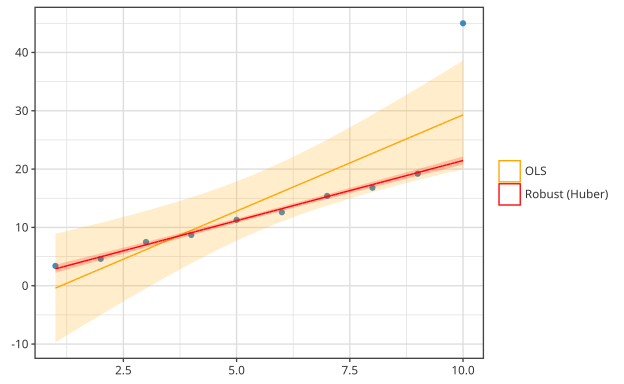

# Generalized Regression advanced + Robust Regression (Phase 31)

Phase 31 (2026-05-29) adds **advanced regularised regression** (Adaptive
Lasso / MCP / SCAD / Group Lasso) and **M-estimator robust regression**
(Huber / Tukey biweight). Matches JMP "Generalized Regression" +
"Robust Fit".

---

## 0. Overview

| Feature | API | Use |
|---|---|---|
| Adaptive Lasso | `RegA.fitAdaptiveLasso` | Improved sparse recovery (oracle property, Zou 2006) |
| MCP | `RegA.fitMCP` | Non-convex penalty, reduced bias for large coefficients |
| SCAD | `RegA.fitSCAD` | Same goal, 3-region piecewise (Fan-Li 2001) |
| Group Lasso | `RegA.fitGroupLasso` | Group-wise selection (categorical groups, lag bundles) |
| Huber M-estimator | `Rob.fitRobustLM (Huber k)` | Linear regression robust to outliers |
| Tukey biweight | `Rob.fitRobustLM (Tukey c)` | Complete-rejection M-estimator |

(`RegA` = `Hanalyze.Model.RegularizedAdvanced`, `Rob` = `Hanalyze.Model.Robust`)

---

## 1. Adaptive Lasso

These advanced penalised fits take matrices directly (no spec builder / no
`df |->` verb), but the result type `RegFit` is `Plottable`: `toPlot fit` draws
the coefficient bar (`b0, b1, …`), so a fitted model goes to SVG without data:

```haskell
import qualified Hanalyze.Model.RegularizedAdvanced as RegA
import Hanalyze.Plot (toPlot)
import Graphics.Hgg.Frame   ((|>>))
import Graphics.Hgg.Spec    (ColData)

let w   = RegA.adaptiveWeightsFromOLS 1.0 x y   -- γ = 1
    fit = RegA.fitAdaptiveLasso 0.1 w x y 1000 1e-5
    noDf = [] :: [(Text, ColData)]
    barPlot = noDf |>> toPlot fit                -- coefficient bar
```

(The same `toPlot fit` applies to `fitMCP` / `fitSCAD` / `fitGroupLasso`
results below — all return `RegFit`.)

`w_j = 1 / |β̂_j^OLS|^γ`. Solved by the column-reweighting trick (`x_j' =
x_j / w_j`, standard Lasso, recover `β_j = β_j' / w_j`).

---

## 2. MCP

```haskell
let fit = RegA.fitMCP 0.1 3.0 x y 1000 1e-5
```

Coordinate update (Breheny-Huang 2011): closed form with the Lasso vs.
OLS region split at `|z| = γλ·cSq`. Requires `cSq > 1/γ` (standardise X
and pick `γ ≥ 3`); otherwise falls back to OLS step.

---

## 3. SCAD

```haskell
let fit = RegA.fitSCAD 0.1 3.7 x y 1000 1e-5
```

Three-region piecewise threshold, `a = 3.7` is the Fan-Li recommendation.

---

## 4. Group Lasso

```haskell
let groups = [[0, 1, 2], [3, 4, 5], [6, 7]]
    fit    = RegA.fitGroupLasso 0.05 groups x y 1000 1e-5
```

Penalty `λ Σ_g √|g| · |β_g|₂` zeros out entire groups via block
coordinate descent.

---

## 5. Robust Regression

The high-level verb `df |-> robust est "x" "y"` fits a two-variable robust
regression from any [`ColumnSource`](../io/04-fit-api.md) and returns a
`RobustModel` (which is `Plottable`, so `toPlot` overlays the robust line):

```haskell
import Hanalyze.Plot (robust, (|->), toPlot)
import Hanalyze.Model.Robust (RobustEstimator (..), defaultHuberK, defaultTukeyC)
import Graphics.Hgg.Frame   ((|>>))
import Graphics.Hgg.Spec    (ColData (..), layer, scatter)
import qualified Data.Vector as V

let df = [ ("x", NumData (V.fromList xs)), ("y", NumData (V.fromList ys)) ]
    mH = df |-> robust (Huber defaultHuberK) "x" "y"   -- RobustModel
    plot = df |>> (layer (scatter "x" "y") <> toPlot mH)
```

**Lower-level (`Rob.fitRobustLM`)** — call the IRLS fit directly for the
`RobustFit` (coefficients / scale / weights):

```haskell
import qualified Hanalyze.Model.Robust as Rob

let fitH = Rob.fitRobustLM (Rob.Huber Rob.defaultHuberK) x y 50 1e-6
    fitT = Rob.fitRobustLM (Rob.Tukey Rob.defaultTukeyC) x y 50 1e-6
```

IRLS: OLS init → MAD-based `σ̂` → standardised residuals `u_i = r_i/σ̂` →
weights `w_i` → weighted LS, repeated until convergence.

| Estimator | Weight | Note |
|---|---|---|
| `Huber k` (1.345) | `1` or `k/|u|` | Smooth, linear-then-clipped |
| `Tukey c` (4.685) | `(1-(u/c)²)²` or `0` | Complete rejection; multimodal — needs good init |

`Rob.rfWeights` after fit reveals which points were down-weighted (a
useful outlier flag).

A single outlier added at the end of the series drags the OLS line toward
it, while the Huber fit keeps the slope of the bulk of the data:



---

## 6. Caveats

- **MCP / SCAD non-convexity**: when `cSq ≤ 1/γ` (MCP) the closed-form
  CD step is undefined; the implementation falls back to the OLS step.
  Standardise X and use `γ ≥ 3`.
- **Tukey init dependence**: complete-rejection introduces local minima.
  OLS init is reasonable; for safety, run Huber first and use its
  coefficients as warm start.
- **Adaptive Lasso `w_j = 0`**: treated as "force `β_j = 0`". To make a
  column unpenalised, set `w_j = 1e-8`.

---

## 7. References

- Zou (2006) JASA 101 — Adaptive Lasso
- Zhang (2010) Ann. Stat. 38 — MCP
- Fan-Li (2001) JASA 96 — SCAD
- Yuan-Lin (2006) JRSSB 68 — Group Lasso
- Breheny-Huang (2011) Ann. Appl. Stat. 5:232-253 — non-convex CD updates
- Huber (1964) / Tukey (1977) / Rousseeuw-Leroy (1987)
- Comparable: R `glmnet` (adaptive), `ncvreg`, `grpreg`, `MASS::rlm`;
  JMP "Generalized Regression", "Robust Fit"
- Deferred to a later phase: Dantzig Selector (needs LP), LTS
  (combinatorial / FAST-LTS).
