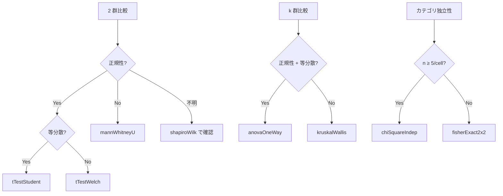

# Stat.Test — 仮説検定

> hanalyze の `Stat.Test` モジュールは scipy.stats / R の base 統計検定相当の
> 仮説検定 12 種を統一 API (`TestResult`) で提供します。

## 1. 設計方針

**統一結果型** で「どのテストでも同じ形のレコード」を返却。
p-value 比較や effect size 取得を一箇所で扱えます:

```haskell
data TestResult = TestResult
  { trMethod       :: !Text                    -- "Welch's t-test"
  , trStatistic    :: !Double                  -- t, F, χ², U, ...
  , trDf           :: !(Maybe (Double, Maybe Double))  -- (df1, df2)
  , trPValue       :: !Double
  , trEffect       :: !(Maybe (Text, Double))  -- ("Cohen's d", 0.42)
  , trCI           :: !(Maybe (Double, Double))
  , trAlternative  :: !Alternative              -- TwoSided / Less / Greater
  , trNote         :: !(Maybe Text)             -- 近似/警告
  }
```

## 2. 実装テスト一覧

### パラメトリック (位置)

| 関数 | 説明 |
|---|---|
| `tTest1Sample xs μ₀ alt` | 1-sample t-test (vs μ₀)、Cohen's d + 95% CI 付き |
| `tTestPaired xs ys alt` | 対応のあるサンプル |
| `tTestWelch xs ys alt` | Welch (等分散仮定なし) |
| `tTestStudent xs ys alt` | Student (等分散仮定) |
| `anovaOneWay [g1, g2, ...]` | 一元配置、η² 付き |

### ノンパラメトリック (位置 / 順位)

| 関数 | 説明 |
|---|---|
| `mannWhitneyU xs ys alt` | rank-sum、rank-biserial r 付き |
| `wilcoxonSignedRank xs ys alt` | 対応のある非パラメ |
| `kruskalWallis [g1, ...]` | k 群非パラメ ANOVA、χ² 近似 |

### 適合度 / 独立性

| 関数 | 説明 |
|---|---|
| `chiSquareGOF observed expected` | 1 次元適合度 |
| `chiSquareIndep contingencyTable` | 分割表、Cramér's V 付き |
| `fisherExact2x2 ((a,b),(c,d)) alt` | 2×2 厳密検定、odds ratio |

### 正規性

| 関数 | 説明 |
|---|---|
| `shapiroWilk xs` | Royston 1992 近似 |
| `kolmogorovSmirnovNormal xs` | KS vs N(0, 1) |

### 分散一致性

| 関数 | 説明 |
|---|---|
| `leveneTest [g1, ...]` | Brown-Forsythe (中央値ベース) |
| `bartlettTest [g1, ...]` | パラメ (正規性仮定) |
| `fTestVariance xs ys alt` | 2 群 F-test |

## 3. 使用例

```haskell
import qualified Stat.Test as ST
import qualified Numeric.LinearAlgebra as LA

-- A/B テストの平均差
let groupA = LA.fromList [12, 14, 13, 15, 17, 11, 16]
    groupB = LA.fromList [18, 22, 20, 19, 25, 17, 21]
    result = ST.tTestWelch groupA groupB ST.TwoSided

-- 結果へのアクセス
ST.trPValue   result   -- p-value
ST.trEffect   result   -- Just ("Cohen's d", -1.85)
ST.trMethod   result   -- "Welch's t-test"

-- 多群比較
let g1 = LA.fromList [1, 2, 3, 4, 5]
    g2 = LA.fromList [4, 5, 6, 7, 8]
    g3 = LA.fromList [7, 8, 9, 10, 11]
    anova = ST.anovaOneWay [g1, g2, g3]
    nonParam = ST.kruskalWallis [g1, g2, g3]

-- 正規性確認
let normRes = ST.shapiroWilk groupA
    homoRes = ST.leveneTest [groupA, groupB]
```

## 4. p-value 補正との連携

複数検定を行う場合は `Stat.MultipleTesting` で補正:

```haskell
import qualified Stat.MultipleTesting as MT

let pVals = [ST.trPValue (ST.tTestWelch g1 g2 ST.TwoSided) | (g1, g2) <- pairs]
    adjusted = MT.benjaminiHochberg pVals
```

## 5. 検定の選び方



## 6. 効果量と Power 解析

p-value だけでなく effect size を併記する習慣を:

- `tTest*` は `trEffect` に Cohen's d を返却
- `anovaOneWay` は η² を返却
- 詳細・Power 解析は [`Stat.Effect`](09-effect.ja.md) 参照

## 7. 参考文献

- Welch (1947) "The generalisation of 'Student's' problem when several
  different population variances are involved", Biometrika.
- Mann & Whitney (1947) "On a test of whether one of two random
  variables is stochastically larger than the other", Ann. Math. Stat.
- Royston (1992) "Approximating the Shapiro-Wilk W-test for
  non-normality", Stat. & Comput.
- Brown & Forsythe (1974) "Robust tests for the equality of variances",
  JASA.
