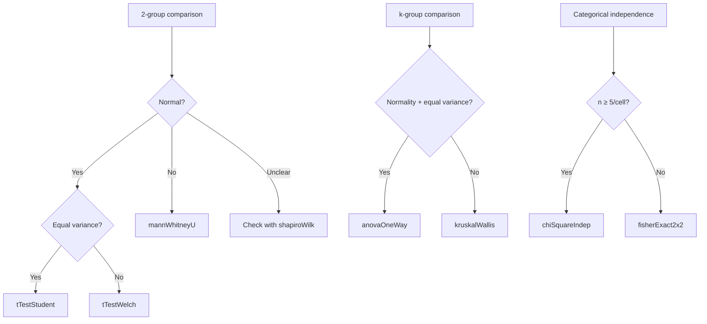

# Stat.Test — Hypothesis Testing

> 🌐 **English** | [日本語](01-test.ja.md)

> hanalyze's `Hanalyze.Stat.Test` module provides 12 hypothesis tests unified by a single API (`TestResult`),
> equivalent to scipy.stats / R base statistical tests.

## 1. Design Principle

**Unified result type** returns "the same shape record for any test," allowing p-value comparison
and effect size retrieval in one place:

```haskell
data TestResult = TestResult
  { trMethod       :: !Text                    -- "Welch's t-test"
  , trStatistic    :: !Double                  -- t, F, χ², U, ...
  , trDf           :: !(Maybe (Double, Maybe Double))  -- (df1, df2)
  , trPValue       :: !Double
  , trEffect       :: !(Maybe (Text, Double))  -- ("Cohen's d", 0.42)
  , trCI           :: !(Maybe (Double, Double))
  , trAlternative  :: !Alternative              -- TwoSided / Less / Greater
  , trNote         :: !(Maybe Text)             -- approximation/warning
  }
```

## 2. Implementation Test List

### Parametric (Location)

| Function | Description |
|---|---|
| `tTest1Sample xs μ₀ alt` | 1-sample t-test (vs μ₀), with Cohen's d + 95% CI |
| `tTestPaired xs ys alt` | Paired samples |
| `tTestWelch xs ys alt` | Welch (unequal variance assumption) |
| `tTestStudent xs ys alt` | Student (equal variance assumption) |
| `anovaOneWay [g1, g2, ...]` | One-way ANOVA, with η² |

### Non-Parametric (Location / Rank)

| Function | Description |
|---|---|
| `mannWhitneyU xs ys alt` | Rank-sum, with rank-biserial r |
| `wilcoxonSignedRank xs ys alt` | Paired non-parametric |
| `kruskalWallis [g1, ...]` | k-group non-parametric ANOVA, χ² approximation |

### Goodness-of-Fit / Independence

| Function | Description |
|---|---|
| `chiSquareGOF observed expected` | 1D goodness-of-fit |
| `chiSquareIndep contingencyTable` | Contingency table, with Cramér's V |
| `fisherExact2x2 ((a,b),(c,d)) alt` | 2×2 exact test, odds ratio |

### Normality

| Function | Description |
|---|---|
| `shapiroWilk xs` | Royston 1992 approximation |
| `kolmogorovSmirnovNormal xs` | KS vs N(0, 1) |

### Variance Homogeneity

| Function | Description |
|---|---|
| `leveneTest [g1, ...]` | Brown-Forsythe (median-based) |
| `bartlettTest [g1, ...]` | Parametric (normality assumption) |
| `fTestVariance xs ys alt` | 2-group F-test |

## 3. Usage Example

```haskell
import qualified Hanalyze.Stat.Test as ST
import qualified Numeric.LinearAlgebra as LA

-- A/B test mean difference
let groupA = LA.fromList [12, 14, 13, 15, 17, 11, 16]
    groupB = LA.fromList [18, 22, 20, 19, 25, 17, 21]
    result = ST.tTestWelch groupA groupB ST.TwoSided

-- Access results
ST.trPValue   result   -- p-value
ST.trEffect   result   -- Just ("Cohen's d", -1.85)
ST.trMethod   result   -- "Welch's t-test"

-- Multi-group comparison
let g1 = LA.fromList [1, 2, 3, 4, 5]
    g2 = LA.fromList [4, 5, 6, 7, 8]
    g3 = LA.fromList [7, 8, 9, 10, 11]
    anova = ST.anovaOneWay [g1, g2, g3]
    nonParam = ST.kruskalWallis [g1, g2, g3]

-- Normality check
let normRes = ST.shapiroWilk groupA
    homoRes = ST.leveneTest [groupA, groupB]
```

## 4. Integration with p-value Correction

For multiple tests, correct via `Hanalyze.Stat.MultipleTesting`:

```haskell
import qualified Hanalyze.Stat.MultipleTesting as MT

let pVals = [ST.trPValue (ST.tTestWelch g1 g2 ST.TwoSided) | (g1, g2) <- pairs]
    adjusted = MT.benjaminiHochberg pVals
```

## 5. Test Selection Guide



## 6. Effect Size and Power Analysis

Beyond p-value, pair with effect size:

- `tTest*` returns Cohen's d in `trEffect`
- `anovaOneWay` returns η²
- Details and power analysis: see [`Hanalyze.Stat.Effect`](09-effect.md)

When comparing multiple test results, forest plot with effect size, mean difference, and 95% CI
per row makes effect magnitude and uncertainty clear at a glance (CI crossing zero indicates non-significance).


## 7. References

- Welch (1947) "The generalisation of 'Student's' problem when several
  different population variances are involved", Biometrika.
- Mann & Whitney (1947) "On a test of whether one of two random
  variables is stochastically larger than the other", Ann. Math. Stat.
- Royston (1992) "Approximating the Shapiro-Wilk W-test for
  non-normality", Stat. & Comput.
- Brown & Forsythe (1974) "Robust tests for the equality of variances",
  JASA.
