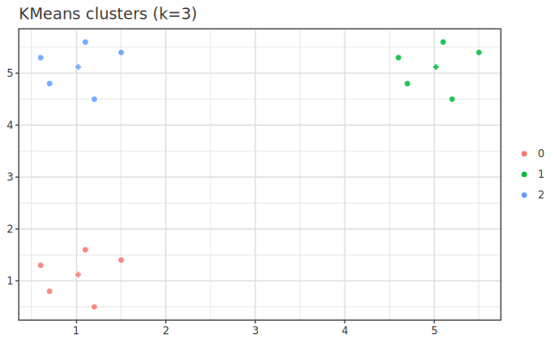
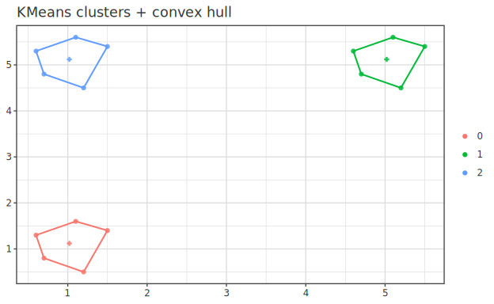
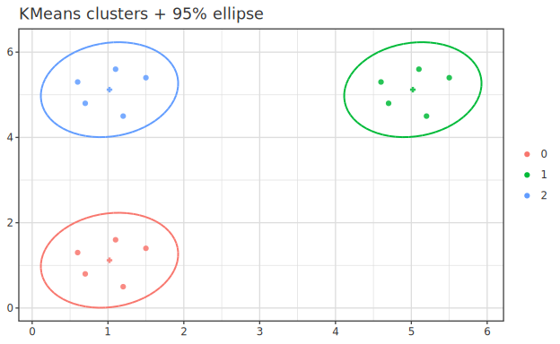
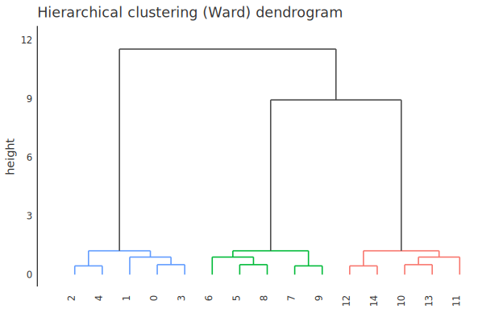

# Model.Cluster — Clustering

> 🌐 **English** | [日本語](05-cluster.ja.md)

> Equivalent to sklearn.cluster. Implements K-means + silhouette coefficient +
> hierarchical clustering (dendrogram). DBSCAN planned for later phase.

## 1. K-means

```haskell
import qualified Hanalyze.Model.Cluster as Cl
import qualified Numeric.LinearAlgebra as LA
import qualified System.Random.MWC as MWC

gen <- MWC.createSystemRandom

let xs = LA.fromLists [[1, 2], [1.1, 2.1], [10, 10], [10.5, 10.5], ...]
    cfg = Cl.defaultKMeansConfig 2  -- k=2

result <- Cl.kMeans cfg xs gen

Cl.kmrCentroids result   -- 2 × p centroid matrix
Cl.kmrLabels result      -- cluster ID per sample
Cl.kmrInertia result     -- within-cluster SS
Cl.kmrConverged result   -- True if converged within tol
```

Color-coding scatter points by cluster ID from `kmrLabels` directly shows assignment.
The figure below shows assignment results for k=3.



### Enclosing Clusters (Convex Hull / 95% Ellipse)

Adding "enclosures" around point groups makes each cluster's spread apparent at a glance.
The plot integration layer (`Hanalyze.Plot`) provides 2 enclosure methods with cluster colors
matching `clusterScatterOf`.

```haskell
-- clusterHullOf    = Convex hull outline (ggplot geom_encircle equivalent, actual data boundary)
-- clusterEllipseOf = 95% covariance ellipse (ggplot stat_ellipse equivalent, equiprobability line under normality)
cdf |>> ( clusterScatterOf cdf kres "x" "y"
          <> clusterHullOf    cdf kres "x" "y"     -- or clusterEllipseOf
          <> centroidsOf kres 0 1 )
```

Convex hull is the actual data boundary; the ellipse is an equiprobability line under
distributional assumption, with different uses (both provided).





## 2. Configuration

```haskell
data KMeansConfig = KMeansConfig
  { kmK        :: Int       -- cluster count
  , kmInit     :: KMeansInit  -- Forgy | KMeansPlus
  , kmMaxIter  :: Int       -- default 300
  , kmTol      :: Double    -- default 1e-4
  , kmRestarts :: Int       -- default 10 (multi-restart takes best inertia)
  }
```

`KMeansPlus` (k-means++) is default. Higher initialization quality than Forgy with
O(log k) approximation guarantee on average (Arthur-Vassilvitskii 2007).

## 3. Choosing Number of Clusters (Elbow + Silhouette)

```haskell
-- Elbow: inertia vs k
let inertias = forM [2 .. 8] $ \k -> do
      r <- Cl.kMeans (Cl.defaultKMeansConfig k) xs gen
      pure (k, Cl.kmrInertia r)

-- Silhouette: select max from k=2 onward
silhouettes <- forM [2 .. 8] $ \k -> do
  r <- Cl.kMeans (Cl.defaultKMeansConfig k) xs gen
  pure (k, Cl.silhouette xs (Cl.kmrLabels r))
```

| Silhouette Value | Interpretation |
|---|---|
| ≥ 0.7 | Strong structure |
| 0.5 ~ 0.7 | Reasonable structure |
| 0.25 ~ 0.5 | Weak structure |
| < 0.25 | No structure or over-splitting |

## 4. Hierarchical Clustering (Dendrogram)

`Hanalyze.Model.HierarchicalCluster` implements agglomerative hierarchical clustering
(Single / Complete / Average / Ward linkage). The result `HClusterFit` renders directly
to **dendrogram** via `toPlot` (scipy `dendrogram` / R `hclust` style).

```haskell
import qualified Hanalyze.Model.HierarchicalCluster as HC

let hfit = HC.fitHierarchical HC.Ward xs   -- xs = n × p matrix

-- Default dendrogram (monochrome)
noDf |>> (toPlot hfit <> title "Hierarchical clustering (Ward)")

-- Color threshold coloring leaf clusters (scipy color_threshold style)
noDf |>> dendrogramOf' defaultDendroOpts { doColorThreshold = Just 3.0 } hfit
```

The vertical axis `height` is merge height (dissimilarity when 2 clusters merge; Ward is
variance increase on merge). Lower merge heights indicate more similarity. Subtrees below
the threshold are colored by `cutTree` clusters; links above the threshold are monochrome.



> Dendrogram rendering uses the plot custom mark (Phase 48, `hgg-custom`'s `dendrogramMark`)
> emitting baked-in line segments for U-shaped links, with HS/PS parity. Hull enclosures
> (outline only) are currently annotation-based; arbitrary polygon semi-transparent fill
> will move to formal plot marks (`MPolygon`/`MTile`) when ready.

## 5. Caution

- **Feature scaling mandatory** (Euclidean distance assumed). Preprocess via `Hanalyze.Stat.Standardize`'s
  `applyStandardizer` recommended
- **Empty cluster handling**: Currently zero vector (room for improvement)
- **Large n**: Mini-batch K-means not yet implemented
