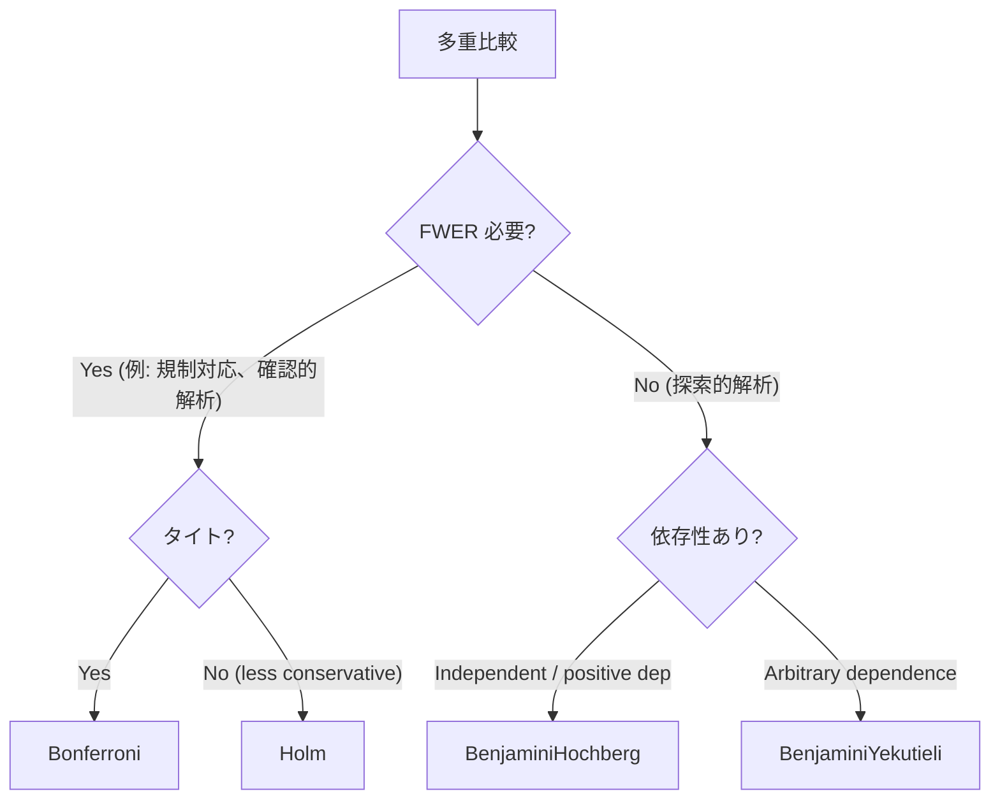

# Stat.MultipleTesting — 多重比較補正

> 複数の p-value を補正して family-wise error rate (FWER) または
> false discovery rate (FDR) を制御。

## 1. API

```haskell
data CorrectionMethod
  = Bonferroni
  | Holm
  | BenjaminiHochberg   -- FDR (BH 1995)
  | BenjaminiYekutieli  -- FDR under arbitrary dependence (BY 2001)

pAdjust :: CorrectionMethod -> [Double] -> [Double]

-- 個別関数も
bonferroni, holm, benjaminiHochberg, benjaminiYekutieli :: [Double] -> [Double]
```

## 2. 使用例

```haskell
import qualified Stat.MultipleTesting as MT

-- 10 個の検定 p-values
let pvals = [0.001, 0.005, 0.012, 0.023, 0.041, 0.063, 0.091, 0.123, 0.156, 0.198]

-- FWER 制御 (厳しい)
MT.bonferroni pvals
-- [0.01, 0.05, 0.12, 0.23, 0.41, 0.63, 0.91, 1.0, 1.0, 1.0]

-- FDR 制御 (BH、推奨)
MT.benjaminiHochberg pvals
-- 順位調整後の q-values
```

## 3. 方法の選び方



## 4. 解釈

| 補正後 | 意味 (FWER) | 意味 (FDR) |
|---|---|---|
| ≤ 0.05 | 有意 (FWER 5%) | 有意 (発見の中の偽陽性率 5%) |
| 同じ raw p の集まり | 全部同じ補正 p | 順位次第で異なる |
