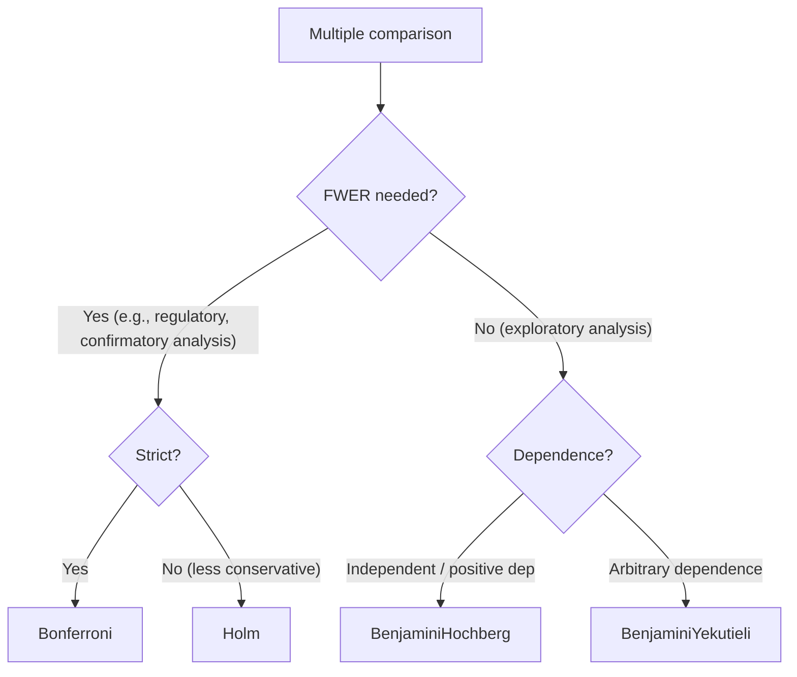

# Stat.MultipleTesting — Multiple Comparison Correction

> 🌐 **English** | [日本語](06-multipletesting.ja.md)

> Corrects multiple p-values to control family-wise error rate (FWER) or
> false discovery rate (FDR).

## 1. API

```haskell
data CorrectionMethod
  = Bonferroni
  | Holm
  | BenjaminiHochberg   -- FDR (BH 1995)
  | BenjaminiYekutieli  -- FDR under arbitrary dependence (BY 2001)

pAdjust :: CorrectionMethod -> [Double] -> [Double]

-- Individual functions also available
bonferroni, holm, benjaminiHochberg, benjaminiYekutieli :: [Double] -> [Double]
```

## 2. Usage Example

```haskell
import qualified Hanalyze.Stat.MultipleTesting as MT

-- 10 test p-values
let pvals = [0.001, 0.005, 0.012, 0.023, 0.041, 0.063, 0.091, 0.123, 0.156, 0.198]

-- FWER control (strict)
MT.bonferroni pvals
-- [0.01, 0.05, 0.12, 0.23, 0.41, 0.63, 0.91, 1.0, 1.0, 1.0]

-- FDR control (BH, recommended)
MT.benjaminiHochberg pvals
-- q-values after rank adjustment
```

## 3. Method Selection Guide



## 4. Interpretation

| Adjusted p | Meaning (FWER) | Meaning (FDR) |
|---|---|---|
| ≤ 0.05 | Significant (FWER 5%) | Significant (5% false discovery rate among discoveries) |
| Same raw p cluster | All get same correction | Varies by rank |
