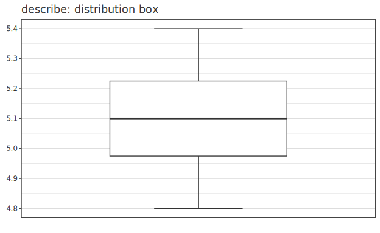

# 雑多な統計拡張 — Fit Y by X / Friedman / Cohen's d CI / LCA / Graphical Lasso (Phase 32)

> Phase 32 (2026-05-29) で **Correlation Network (Graphical Lasso) +
> Latent Class Analysis** を新規追加。 同 NN doc に含まれていた残 3 機能
> (**Fit Y by X / Friedman + Dunn / Cohen's d CI**) は Phase 13 で既実装
> だったので、 本ガイドで 5 機能の **定式化と罠** を集約解説する。 型シグネチャ・
> 最小例は [api-guide 10-stat](../api-guide/10-stat.md) を一次根拠に。

---

## 0. 概観

| 機能 | 用途 |
|---|---|
| Fit Y by X | 変数 2 つを型で自動 dispatch (LM / GLM / ANOVA / chi²) |
| Friedman 検定 | paired multi-group ノンパラ |
| Dunn 多重比較 | Kruskal-Wallis 後の全ペア比較 + p-adjust |
| Cohen's d CI | effect size の信頼区間 (非中心 t 経由) |
| LCA | カテゴリ潜在クラスクラスタリング (EM) |
| Graphical Lasso | sparse precision matrix (= 条件付独立ネットワーク) |

これらの解析の前に、 各変数の分布を箱ひげ図 (`describeBox`) で把握しておくとよい:



---

## 1. Fit Y by X (Phase 13 既実装)

JMP "Fit Y by X" platform 相当。 X / Y の型 (`Continuous` / `Categorical`) を
自動 dispatch:

| X | Y | 解析 |
|---|---|---|
| Cont | Cont | 単回帰 (LM) |
| Cont | Cat  | logistic GLM |
| Cat  | Cont | one-way ANOVA |
| Cat  | Cat  | chi-square independence |

---

## 2. Friedman 検定 + Dunn 多重比較 (Phase 13 既実装)

Friedman は n subjects × k treatments の matrix を取る paired ノンパラ。 Dunn は
Kruskal-Wallis 後の全ペア比較で、 `MultiCompareResult` に全ペアの
`(i, j, p_raw, p_adj)` が入る (Bonferroni / BH の選択は API で指定可・BH 既定)。
`friedmanTest` の `TestResult` は `Plottable` で `toPlot` が 1 行 forest を描く。

---

## 3. Cohen's d CI (Phase 13 既実装)

`cohenDCI` は非中心 t 分布で正確な CI を計算する (= 漸近近似ではない)。 paired 版は
`cohenDPaired`。

---

## 4. LCA (Latent Class Analysis、 Phase 32-A2 新規)

カテゴリ変数の潜在クラスクラスタリング。 EM algorithm。 モデル:

```
P(X_i) = Σ_k π_k · Π_j ρ_{k, j, X_{i,j}}
```

### 注意点

- **label switching**: クラス 0 / 1 がランダムに入れ替わる。 解釈時は ρ の
  pattern で並べ替え推奨
- **初期化依存**: EM は局所最適。 必要なら異なる seed で複数回 fit → 最高
  log-likelihood を採用
- **K 選択**: BIC / AIC で外部判定 (本実装は K 固定)

---

## 5. Graphical Lasso / Correlation Network (Phase 32-A1 新規)

高次元データの相関構造を **sparse precision matrix** で推定。 ゼロ要素は
条件付独立を意味する。 最適化:

```
max_{Θ ≻ 0}  log det Θ - tr(SΘ) - λ ‖Θ‖_{1, off-diag}
```

### 注意点

- **λ チューニング**: 大きいほど sparser。 CV か BIC で選択 (本実装は
  単一 λ 指定)。 試行錯誤の出発点は σ̂_max × 0.1 程度
- **n < p 領域**: 経験共分散 `S` が特異だが、 `Σ ← S + λI` で初期化する
  ため λ > 0 なら fit 可能
- **収束しない場合**: λ が大きすぎる or maxOuter 不足。 100 → 500 試す
- 既存 covariance を再利用するなら `empiricalCov` → `graphicalLassoFromCov`

---

## 6. 関連

- 型・最小例: [api-guide 10-stat](../api-guide/10-stat.md)
- 計画書: `specification/phases/phase-32-misc-stat.md`
- 既存実装 commit: `3a4e056` (Phase 13、 2026-05-24)
- 文献:
  - Friedman, Hastie, Tibshirani (2008) Biostatistics 9(3):432-441
  - Linzer, Lewis (2011) J Stat Softw 42(10) — poLCA
  - Dunn (1964) Technometrics 6 — Dunn 多重比較
  - Smithson (2003) — non-central t による Cohen's d CI
- 比較先: scikit-learn `GraphicalLasso`、 R `glasso` / `poLCA` /
  `scikit-posthocs.posthoc_dunn` / `effsize`、 JMP "Fit Y by X" platform
</content>
