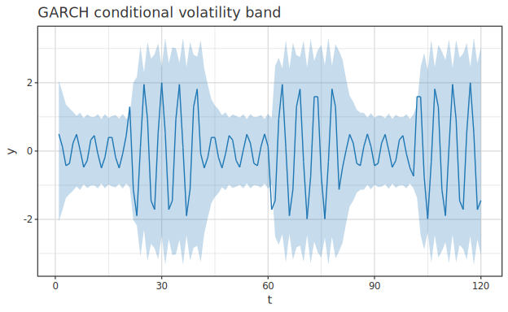

# Time-series and Survival Extensions (Phase 35: GARCH / VAR / Competing Risks / RBD)

> 🌐 **English** | [日本語](usage-ts-surv-advanced.ja.md)

> Learning guide for four advanced time-series and survival analysis features added in Phase 35 (2026-05-29),
> not covered by the existing `Hanalyze.Model.{TimeSeries, Survival, Weibull, Reliability}` modules.
> Type signatures, minimal examples, and `toPlot` paths are documented in 
> [api-guide 06-timeseries](../api-guide/06-timeseries.md) / [07-survival](../api-guide/07-survival.md) as the primary reference.
> This guide covers **formulations and justification for estimation**. State Space / Kalman Filter
> is **already implemented** in `Hanalyze.Model.StateSpace` (Phase 15).

---

## 0. Module Correspondence

| Feature | Note |
|---|---|
| GARCH(1,1) | Gaussian QMLE + L-BFGS |
| VAR(p) | Equation-by-equation OLS |
| Competing Risks (CIF) | Kalbfleisch-Prentice |
| Reliability Block Diagram | Series / Parallel / k-of-n |
| State Space / Kalman | **Phase 15 already implemented** |

---

## 1. GARCH(1,1) (35-A1)

- Model: `σ²_t = ω + α · ε²_{t-1} + β · σ²_{t-1}`, `ε_t = y_t - μ`
- Stationarity constraint (`ω > 0, α ≥ 0, β ≥ 0, α + β < 1`) avoided by reparametrization
  (softplus for ω, two stick-breaking sigmoids for α/β)
- `gLogLik` is the maximized Gaussian log-likelihood. Long-horizon forecasts converge to unconditional variance
  `ω / (1 - α - β)`

Fitted conditional volatility follows the clustering of large returns:

---

## 2. VAR(p) (35-A2)

- Model: `yₜ = c + Σ_l Aₗ · yₜ₋ₗ + εₜ`, each `Aₗ` is `K × K`
- Estimated by equation-by-equation OLS — under Gaussian innovations all equations share
  the same regressors, so SUR = OLS = MLE (Lütkepohl 2005, §3.2)
- `varResiduals` is `(n − p) × K`, `varSigma` is residual covariance

---

## 3. Competing Risks / CIF (35-A3)

- `crCause = 0` is censored, `≥ 1` is a specific failure cause
- Estimator: `F̂_k(t) = Σ_{t_i ≤ t} Ŝ(t_i⁻) · d_{k,i} / n_i`
  (Ŝ is overall KM treating all causes as events, Kalbfleisch & Prentice 1980)
- Important: naive approach "1 − KM on cause-specific data" has upward bias.
  This CIF is the classical correction
- Identity holds at every event time: `Σ_k F̂_k(t) + Ŝ(t) = 1`

As a parametric survival counterpart, AFT model yields smooth survival curves `S(t | x)` with
location shifting by covariates (`fitAFT`, `aftSurvivalAt` produces curves for arbitrary x):

---

## 4. Reliability Block Diagram (35-A4)

- `Leaf p` — component with reliability `p ∈ [0, 1]`
- `Series bs` — `∏ Rᵢ`, all blocks must work
- `Parallel bs` — `1 − ∏ (1 − Rᵢ)`, any single block suffices
- `KofN k bs` — at least `k` of `n` working. Heterogeneous reliabilities computed
  by Poisson-binomial DP (binomial is homogeneous special case)
- Failure independence between blocks is assumed (textbook RBD)

---

## 5. State Space / Kalman (mention only)

`Hanalyze.Model.StateSpace` is implemented in Phase 15 (`kalmanFilter` /
`kalmanSmoother`). See `test/Spec.hs:6443` for a worked example.

---

## 6. Related

- Types and minimal examples: [api-guide 06-timeseries](../api-guide/06-timeseries.md) /
  [07-survival](../api-guide/07-survival.md)
- Specification: `specification/phases/phase-35-timeseries-survival.md`
- References: Lütkepohl (2005) — VAR / Kalbfleisch & Prentice (1980) — CIF
